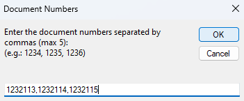
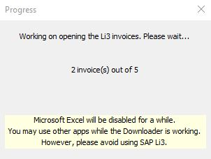
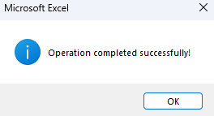
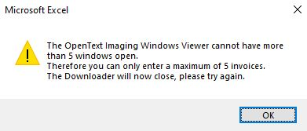
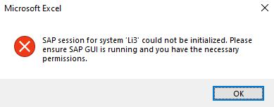
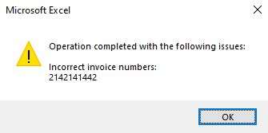

# SAP Invoice Downloader

The purpose of this project is to automate downloading invoices from SAP. 
In the context where downloading invoices from SAP takes long times due to OpenText Imaging app which loads very slowly, this downloader shortened time and effort from the user. While the invoices are being opened, the user can work on other tasks.

## Quick overview

For ease of use accross the department, a GUI was implemented.
1. Insert the invoice numbers, separated by comma's

    

2. Wait for the invoices to be opened in the OpenText Imaging app

    

3. When operation is completed, the user can download the invoices and then run a new batch

    

4. Error handling has been taken into consideration as well:
    1. The user cannot insert more than 5 invoices, because the OpenText Imaging app does not support it

        
    
    2. If SAP Li3 is not open, then the user will get an error

        

    3. In case there are wrong invoice numbers, or in the event of missing attachment in SAP, the user will be informed which invoices could not be processed

        

**Disclaimer!** 
The code was written with the help of Microsoft Copilot, but without proper human guidance the AI would not have made this possible with just a copy-paste. 
This would explain why in some places the code probably could have been better designed.